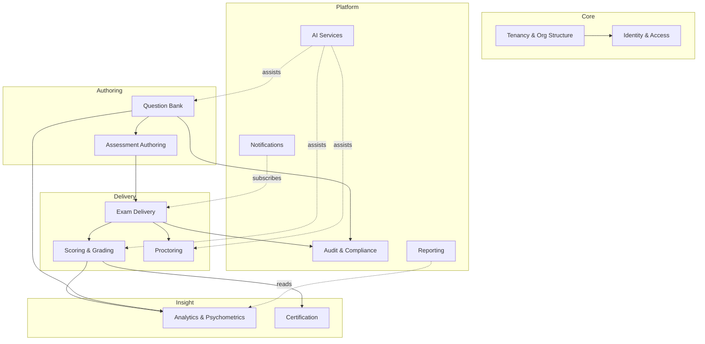

# 01 — Domain Analysis (Domain-Driven Design)

This document establishes the **bounded contexts**, **aggregates**, and
**ubiquitous language** of the platform. Everything downstream — the database
schema, the service topology, the APIs — derives from this model. If the model is
wrong, the system is wrong, so this is the foundation.

---

## 1. Strategic design: why bounded contexts

The specification lists ~13 capability areas. Modelling them as one giant schema
produces a tangle where a change to "scoring" ripples into "proctoring." Instead we
partition the domain into **bounded contexts** — each with its own model, its own
vocabulary, and a clear contract to the rest of the system.

In Laravel terms each context is a **module** (a directory under `app/Modules/`
with its own Models, Services, Actions, Events, and Policies). Contexts communicate
through **domain events** (Laravel events on a queue) and **application services**,
never by reaching into each other's tables. This keeps the deployable a modular
monolith today, and lets any context be carved out into its own service later
without rewriting callers.

---

## 2. Context map

| # | Bounded Context | Responsibility | Key invariant it protects |
|---|-----------------|----------------|---------------------------|
| 1 | **Identity & Access (IAM)** | Authentication, MFA, sessions, RBAC, custom roles, permissions | A subject may only act within permissions granted in a tenant scope |
| 2 | **Tenancy & Org Structure** | The Platform→Institution→…→Learning-Outcome hierarchy; tenant isolation | Data of one institution is never readable by another |
| 3 | **Question Bank** | Authoring, versioning, review/approval workflow, item metadata, import | An item's correct answer is never stored beside the item body |
| 4 | **Assessment Authoring** | Exam definitions, blueprints, scoring rules, randomization recipes | A published exam's blueprint constraints are always satisfiable |
| 5 | **Exam Delivery** | Candidate sessions, runtime assembly, offline mode, sync | A candidate sees exactly one assembled variant; submissions are append-only |
| 6 | **Scoring & Grading** | Auto-scoring, partial/negative/IRT scoring, manual & AI grading | A score is reproducible from the response set + the scoring rule version |
| 7 | **Proctoring** | Live monitoring, AI behavioral signals, risk scoring, evidence, lockdown | Every flag links to immutable evidence and a session |
| 8 | **Analytics & Psychometrics** | Item analysis (p, D, distractors), KR-20, Cronbach α, IRT, candidate analytics | Statistics are computed from finalized response data only |
| 9 | **Certification** | Result slips, certificates, badges, verification, blockchain anchoring | A certificate is verifiable without trusting the issuer's live DB |
| 10 | **Audit & Compliance** | Immutable, hash-chained activity log across all contexts | Log entries cannot be altered or deleted, only appended |
| 11 | **Notifications** | Email / SMS / push / WhatsApp delivery | Delivery is idempotent per (recipient, event) |
| 12 | **Reporting** | PDF/Excel/CSV report generation from read models | Reports never block transactional writes |
| 13 | **AI Services** | Generation, review, duplicate detection, grading assist, fraud detection | AI output is always a *suggestion* pending human authority |

**Relationship patterns** (DDD integration styles):

- IAM and Tenancy are **shared kernel** — almost every context references a tenant
  and a subject. They are the only contexts other contexts may read directly.
- Question Bank → Assessment Authoring is **customer/supplier**: authoring consumes
  item references but cannot mutate items.
- Exam Delivery → Scoring is a **conformist** relationship downstream of a published
  contract (the scoring rule snapshot).
- AI Services is an **open-host service / anti-corruption layer**: every other
  context calls it through an interface and translates its output, so swapping the
  model provider never leaks into domain logic.

---

## 3. Ubiquitous language (glossary)

Precise terms prevent the "quiz vs. test vs. exam" ambiguity that wrecks schemas.

| Term | Definition |
|------|------------|
| **Tenant** | An isolation boundary. The top-level tenant is an *Institution*; the *Platform* is the root super-tenant. |
| **Org Node** | A node in the academic hierarchy (Faculty, Department, Programme, Course, Topic, Learning Outcome). |
| **Item** | A single reusable question in the bank. *Never called "question" in code* to avoid confusion with a delivered question instance. |
| **Item Version** | An immutable revision of an Item. Editing creates a new version; published exams pin a specific version. |
| **Answer Key** | The scoring truth for an Item Version, stored in a **separate context boundary** and encrypted (see security doc). |
| **Stimulus** | Shared content (passage, image, audio, video, case study) that multiple Items attach to. |
| **Assessment** | The authored definition of an exam: blueprint, sections, scoring rule, schedule, proctoring policy. *This is the template.* |
| **Exam Form / Variant** | A concrete assembled set of Items+order produced for a candidate by the randomization engine. |
| **Sitting** | One candidate's attempt at an Assessment: their assigned Variant, their Responses, timing, proctoring data. |
| **Response** | A candidate's answer to one delivered question within a Sitting. Append-only. |
| **Score** | A computed result for a Sitting under a specific Scoring Rule version. |
| **Blueprint** | Constraints describing the desired composition of a paper (% by difficulty, topic, Bloom level, item type). |
| **Scoring Rule** | A versioned, named policy (e.g. +4/−1/0) attached to an Assessment or a Section. |
| **Flag** | A proctoring observation of potential misconduct, with type, confidence, timestamp, and evidence. |
| **Risk Score** | An aggregate, explainable cheating-probability for a Sitting derived from Flags. |
| **Subject** | An authenticated actor (a User acting in a Role within a Tenant scope). |

---

## 4. Aggregates and their boundaries

An **aggregate** is a consistency boundary — the unit that is loaded, validated, and
saved as a whole. Choosing aggregate roots correctly is the single most important
modelling decision.

### 4.1 Identity & Access
- **User** (root): credentials, MFA factors, status. *Identity only* — no roles.
- **RoleAssignment** (root): binds a User to a Role within a Tenant/Org scope. This is
  separate from User so a person can hold Lecturer in one department and Exam Officer
  in another. Permissions are resolved as the union of role permissions in scope.
- **Role** (root): a named permission set; may be a system role or a custom tenant role.

### 4.2 Tenancy & Org Structure
- **Institution** (root): the tenant. Owns settings, branding, isolation key reference.
- **OrgNode** (root): self-referential tree (Faculty→Department→Programme→Course→Topic→
  Learning Outcome). A single table with `type` + `parent_id` models the whole hierarchy
  and lets it vary per institution (some have faculties, some don't).

### 4.3 Question Bank
- **Item** (root): owns its **Item Versions** (a version is *not* an independent
  aggregate — you never load a version without its item). The Item references org nodes,
  Bloom level, difficulty, item type. The **Answer Key is deliberately excluded** from
  this aggregate and lives in its own context — this is a structural security decision,
  not an accident (see §6).
- **Stimulus** (root): shared passage/media; Items reference it.
- **ItemReview** (root): the moderation workflow record (Draft→Reviewed→Moderated→
  Approved→Retired), with reviewer, comments, decision.

### 4.4 Assessment Authoring
- **Assessment** (root): owns **Sections**, references a **Blueprint**, a **Scoring
  Rule**, a **Proctoring Policy**, and a schedule window. Items are referenced by
  *Item Version id* so the paper is reproducible even after the bank changes.
- **Blueprint** (root): reusable composition constraints.
- **ScoringRule** (root): versioned scoring policy.

### 4.5 Exam Delivery
- **Sitting** (root): the candidate attempt. Owns **Responses** (append-only),
  timing, the assigned Variant manifest, and offline-sync metadata. This is the
  hottest aggregate at scale — see the architecture doc for partitioning.

### 4.6 Scoring & Grading
- **Score** (root): result for a Sitting; references the ScoringRule version used and
  carries per-section, per-competency breakdowns.
- **GradingTask** (root): a manual/AI grading unit for open-ended Responses, routed to
  graders with double-marking and reconciliation.

### 4.7 Proctoring
- **ProctoringSession** (root): mirrors a Sitting; owns **Flags** and **EvidenceClips**.
- **RiskAssessment** (root): the computed, explainable risk score + timeline.

### 4.8 Analytics, Certification, Audit, Notifications, Reporting, AI
- **ItemStatistics**, **AssessmentReliability** (read models, recomputed).
- **Certificate** (root): issued credential + verification token + optional anchor.
- **AuditEntry** (root, append-only, hash-chained).
- **Notification**, **Report**, **AiJob** (roots in their respective contexts).

---

## 5. Key domain events

Contexts integrate by publishing/subscribing to events (Laravel events → Redis queue).

| Event | Published by | Consumed by |
|-------|--------------|-------------|
| `ItemApproved` | Question Bank | Analytics (seed stats), Audit |
| `AssessmentPublished` | Authoring | Delivery (open scheduling), Notifications |
| `SittingStarted` | Delivery | Proctoring (open session), Audit |
| `ResponseRecorded` | Delivery | Proctoring (behavioral correlation) |
| `SittingSubmitted` | Delivery | Scoring (compute), Proctoring (finalize) |
| `ScoreFinalized` | Scoring | Analytics, Certification, Notifications |
| `FlagRaised` | Proctoring | Audit, Notifications (invigilator) |
| `RiskAssessed` | Proctoring | Reporting, Authoring (QA review queue) |

Events are the seam along which contexts will later split into microservices: each
already communicates asynchronously and owns its own data.

---

## 6. The structural security invariant (preview)

The single most important domain rule, stated here because it shapes the schema:

> **An Item and its Answer Key are never in the same aggregate, never in the same
> table, and ideally never in the same database with a discoverable foreign key.**

The Question Bank context stores item bodies and distractors. A separate
**Answer Key store** (its own schema/service, separately encrypted with split keys)
holds the scoring truth, keyed by an opaque per-version token rather than a plain
`item_id`. At delivery time the runtime assembles the mapping per Sitting. An attacker
with full read access to the Question Bank database therefore obtains questions but
**not** which option is correct. The full mechanism is in
[`04-security-architecture.md`](04-security-architecture.md).

---

## 7. Why this model satisfies the spec

- **Every question type** (single/multiple/matching/ordering/hotspot/essay/code/SQL/
  simulation…) is one `Item` with a `type` and a typed `content` payload — no new table
  per type, so adding a type is data, not a migration.
- **Adaptive/branching exams** are expressed as Variant assembly rules + response-gated
  unlocking in Delivery, not hard-coded.
- **Multi-tenancy** is enforced once, in the Tenancy shared kernel, and every aggregate
  carries a `tenant_id` checked by a global query scope — isolation is not per-developer
  discipline.
- **Scaling to 1M** is feasible because the hot path (Sitting/Response) is a small,
  partitionable aggregate decoupled from the heavy authoring and analytics contexts.
