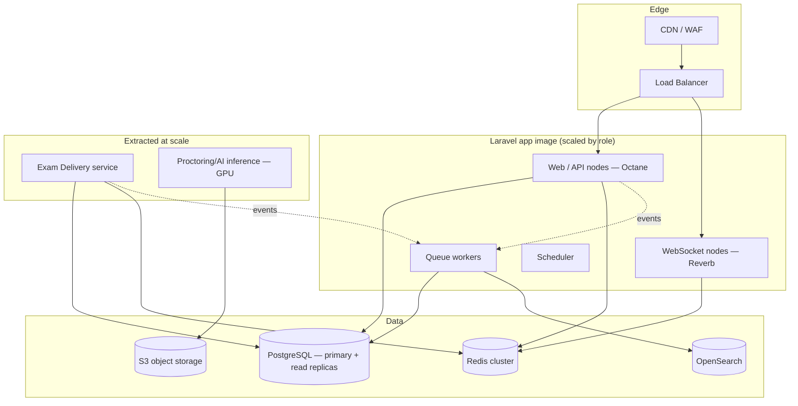
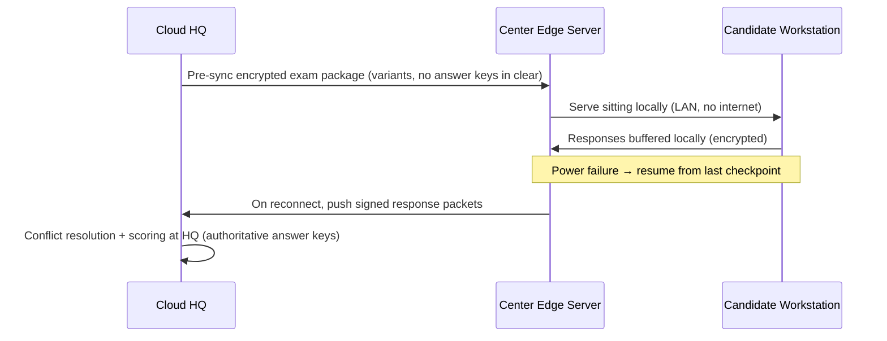

# 02 — System Architecture

This document describes the runtime topology, the deployment tiers, and — most
importantly — *how the same codebase scales from 100 users to 1M+ concurrent
candidates*. The guiding principle is **modular monolith first, extractable
services later**: we get the operational simplicity of one deployable while the
bounded contexts (doc 01) keep the seams clean for extraction when load demands it.

---

## 1. Why "modular monolith first" and not microservices-first

The spec says "microservices-first." We deliberately temper that, because a fleet of
13 services on day one buys distributed-systems cost (network failure modes, eventual
consistency everywhere, 13 deploy pipelines) before there is load to justify it. The
better path for an assessment platform — where load is **spiky and predictable**
(exams are scheduled) rather than constant — is:

1. **One Laravel application** organised into the bounded-context modules of doc 01.
2. **Independent horizontal scaling of process *roles*** off that one image: web
   (FrankenPHP/Octane), queue workers, websocket nodes, scheduler. This already
   delivers most of the elasticity microservices promise.
3. **Carve out a context into its own service only when its scaling profile diverges**
   from the rest. Two contexts will need this early at national scale: **Exam Delivery**
   (millions of concurrent stateful sessions) and **AI/Proctoring inference** (GPU-bound,
   bursty). Both already talk to the rest only via events, so extraction is mechanical.

---

## 2. Process roles (one image, many runtimes)

| Role | Runtime | Scales on | Notes |
|------|---------|-----------|-------|
| **Web / API** | Laravel Octane on FrankenPHP | requests/sec | Stateless; behind LB; autoscaled |
| **WebSocket** | Laravel Reverb (or Soketi) | concurrent connections | Live proctoring grid, timers, announcements |
| **Queue workers** | `queue:work` on Redis/Horizon | queue depth | Scoring, imports, report generation, AI jobs, notifications |
| **Scheduler** | `schedule:run` (singleton) | n/a | Exam window opening, reminders, stats recompute |
| **Offline sync gateway** | dedicated worker pool | reconnect bursts | Reconciles exam-center sync packets |

Horizon supervises queues with separate connections per workload class so a flood of
report jobs never starves time-critical scoring jobs.

---

## 3. Scaling strategy by tier

The platform must run economically at 100 users and survive 1M concurrent. We define
explicit deployment tiers so an institution provisions only what it needs.

| Tier | Concurrent candidates | Shape |
|------|----------------------|-------|
| **T0 Single-node** | ≤ 500 | One VM: app + Postgres + Redis via Docker Compose. Pilot/dev. |
| **T1 Departmental** | ≤ 5k | Managed Postgres + Redis; 2–4 app nodes; 1 WS node. |
| **T2 Institutional** | ≤ 50k | K8s; Postgres primary + read replicas; Redis cluster; Horizon fleet; OpenSearch. |
| **T3 National** | 1M+ | Multi-region K8s; Delivery extracted & sharded; GPU inference fleet; Postgres sharded by tenant; CDN-fronted static exam assets. |

### Scaling the hot path (Sittings & Responses)

At T3 the bottleneck is millions of concurrent `Sitting` aggregates each appending
`Response` rows. The strategy:

1. **Shard by tenant** — an institution's data lives on one shard; cross-tenant queries
   are an analytics-only, replica-served concern. National exams that span institutions
   shard by exam-center region instead.
2. **Write-buffer responses through Redis.** A candidate's answers are written to a
   per-Sitting Redis structure first (fast, durable enough with AOF), and flushed to
   Postgres in batches by a worker. The DB sees batched appends, not per-keystroke writes.
3. **Partition `responses` by month** (PostgreSQL declarative partitioning) so the live
   partition stays small and indexes stay hot.
4. **Pre-assemble variants.** Randomization runs *before* the exam window (a worker job),
   materializing each candidate's variant manifest into Redis/S3 so exam-start is a read,
   not a CPU-bound assembly under peak load.

### Read scaling

Analytics, reporting, dashboards, and verification portals read from **read replicas**
and **OpenSearch projections**, never the primary. The primary is reserved for the
transactional write path.

---

## 4. Module → deployment mapping

Each doc-01 context is a directory under `app/Modules/<Context>` containing
`Models/ Services/ Actions/ Http/ Events/ Listeners/ Policies/ Jobs/`. They share the
Laravel kernel today; the table below records the **intended extraction order** so the
seams are respected from day one.

| Context | Day-1 home | Extract at | Why |
|---------|-----------|-----------|-----|
| IAM, Tenancy | monolith (shared kernel) | never | referenced everywhere |
| Question Bank, Authoring | monolith | T3 (optional) | write-light |
| **Exam Delivery** | monolith | **T2→T3** | stateful, highest concurrency |
| Scoring | queue workers | T3 | CPU bursts at submit time |
| **Proctoring / AI inference** | queue workers + sidecar | **T1→T2** | GPU, different language (Python) |
| Analytics | workers + OpenSearch | T2 | heavy aggregation |
| Notifications, Reporting | workers | rarely | I/O bound, already async |

The **AI/Proctoring inference** plane is the one piece that is *not* PHP: vision and
audio models run as a **Python (FastAPI) inference service** behind an anti-corruption
interface (`App\Modules\Proctoring\Contracts\InferenceClient`). Laravel sends frames/
signals and receives structured findings; swapping the model never touches domain code.

---

## 5. Data stores and their jobs

| Store | Role | Not used for |
|-------|------|--------------|
| **PostgreSQL** | system of record; transactional integrity; partitioned hot tables; row-level tenant scoping | analytics scans, full-text search |
| **Redis** | cache, queues (Horizon), websocket pub/sub, response write-buffer, rate limiting, distributed locks | durable system of record |
| **OpenSearch** | item search, log analytics, candidate/question analytics projections | transactional truth |
| **S3-compatible** | media stimuli, evidence clips, generated reports/certificates, variant manifests, offline packages | anything needing transactions |
| **Answer-Key store** | isolated, separately-encrypted scoring truth (see security doc) | being joined to questions |

---

## 6. Realtime plane

WebSockets carry: the exam countdown timer (authoritative time from server, not client
clock), the invigilator monitoring grid (candidate tiles + live flags), announcements/
emergency alerts, and proctoring event streams. Channels are **tenant- and
sitting-scoped** and authorized through Laravel broadcasting auth so a candidate can
only subscribe to their own sitting and an invigilator only to assigned sessions.

---

## 7. Offline / low-connectivity exam centers

Many target deployments (recruitment, rural exam centers) lack reliable internet.

- The **edge server** is a hardened Laravel instance with a local Postgres/SQLite and
  Redis. It receives a **pre-synced encrypted package** and serves sittings over the LAN.
- **Answer keys are never shipped in clear to the edge.** Scoring of objective items can
  run at the edge using an encrypted key blob unlocked only inside the exam window with a
  time-boxed key (HQ-issued), or be deferred entirely to HQ on reconnect — configurable
  per exam's sensitivity.
- **Continuity:** responses checkpoint to local durable storage every N seconds so a
  power cut resumes the candidate at their last answered question with the clock adjusted.
- **Sync & conflict resolution:** response packets are append-only and signed; HQ
  reconciles by `(sitting_id, sequence)` — last-writer conflicts are impossible because
  responses are immutable appends, not updates.

---

## 8. Observability & operations

- **Metrics:** Prometheus scrapes app/queue/WS exporters; Grafana dashboards per tier
  with SLOs (exam-start latency, response-write p99, scoring backlog).
- **Logs:** structured JSON → ELK; correlation id propagated request→job→event.
- **Tracing:** OpenTelemetry spans across web→queue→inference.
- **Health gates:** an exam window will not open if scoring backlog, replica lag, or
  inference queue depth exceed thresholds — fail safe, not silently degrade.

---

## 9. CI/CD & infrastructure-as-code

- **GitHub Actions:** lint (Pint/PHPStan) → unit/feature tests (Pest) → build image →
  deploy to staging → smoke test → promote to prod.
- **Containers:** one app image (FrankenPHP), one inference image (Python), built once,
  configured per role via env. Kubernetes manifests/Helm per tier; HPA on queue depth and
  WS connections, not just CPU.
- **Migrations** run as a pre-deploy K8s job; backward-compatible (expand/contract) so
  rolling deploys never break in-flight sittings.

---

## 10. Architectural risks & mitigations

| Risk | Mitigation |
|------|------------|
| Thundering herd at exam start (everyone clicks "begin" at 09:00) | Pre-assembled variants in Redis/S3; jittered start tokens; WS-pushed "go" rather than client polling |
| Postgres write saturation from responses | Redis write-buffer + batched flush + monthly partitioning |
| Answer-key leakage via DB compromise | Split-key store, separate encryption, opaque tokens (security doc) |
| Proctoring inference cost | Edge/client-side cheap signals first; server GPU only on escalation; sampling not every-frame |
| Tenant data bleed | Global query scope + row-level checks + per-tenant encryption key |
| Clock tampering for timers | Server-authoritative time over WS; client clock never trusted for deadlines |
