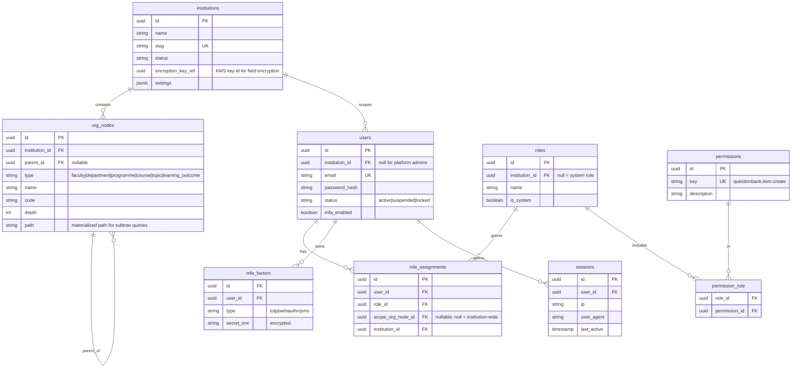
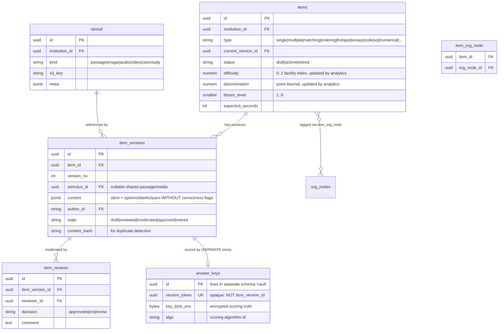
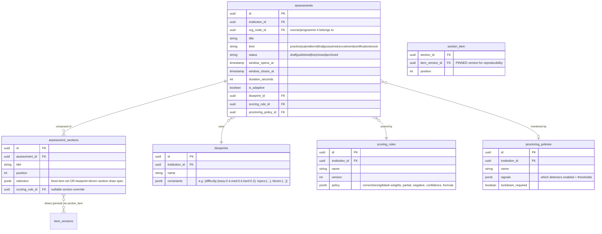
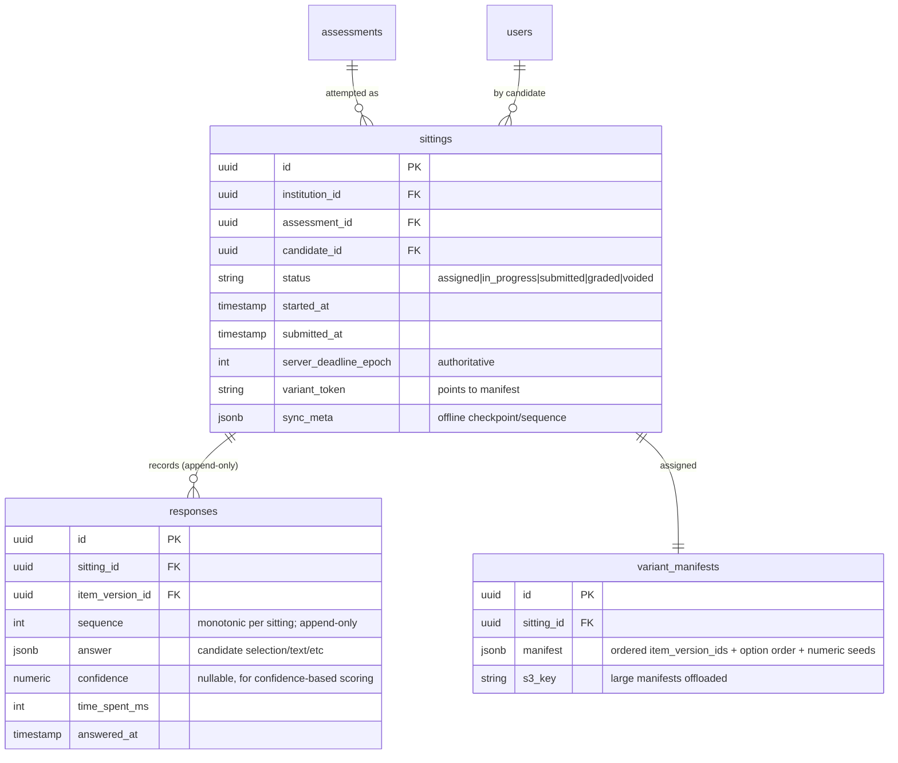
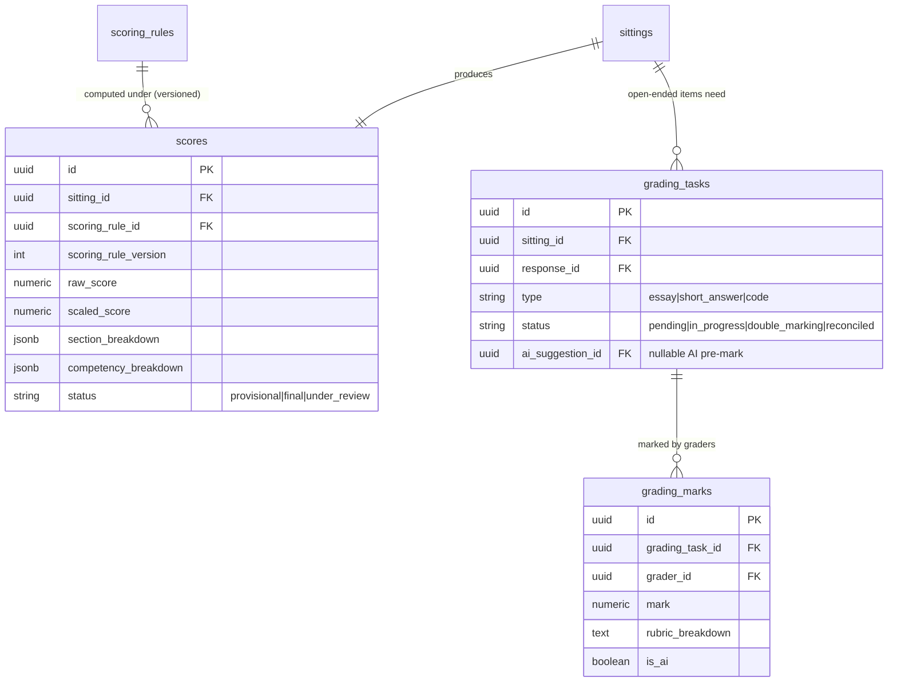
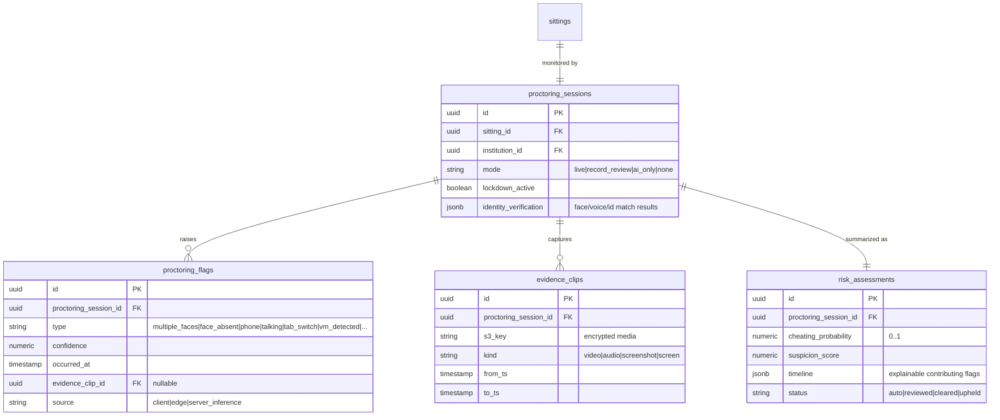
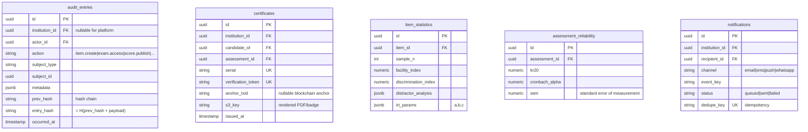

# 03 — Database Schema & Entity-Relationship Diagrams

This is the data model. It is **executable**: every table here exists as a Laravel
migration under [`database/migrations/`](../database/migrations/). The diagrams below
group tables by bounded context (doc 01); the security-critical separation of items
from answer keys is realized physically here.

## Conventions

- **Primary keys are UUIDv7** (`uuid`), not auto-increment integers — so ids are
  non-guessable, globally unique across shards, and time-ordered for index locality.
- **Every tenant-scoped table carries `institution_id`** and is filtered by a global
  Eloquent scope. The `platform`-level tables (system roles, platform admins) do not.
- **Timestamps** `created_at`, `updated_at` everywhere; soft deletes (`deleted_at`)
  only where retention requires it (items, assessments) — *never* on responses, scores,
  or audit (those are append-only / immutable).
- **Money/score values** use `numeric`, never float, to keep scoring reproducible.
- **JSONB** holds typed-but-variable payloads (item content per type, blueprint rules,
  scoring formulas) so adding a question type is data, not a migration.
- **Enums** are PostgreSQL `text` + `check` constraints (portable, alterable) rather
  than native enum types.

---

## 1. Tenancy & Identity (shared kernel)

**Why `role_assignments` is separate from `users`:** a person is a Lecturer in
Physics *and* an Exam Officer in the Faculty of Science. Roles are scoped to an
org node, and effective permissions are the union over a subject's assignments whose
scope is an ancestor-or-self of the resource's org node. Custom roles = a tenant row
in `roles` with `is_system=false`.

---

## 2. Question Bank — **note the answer-key separation**

The **critical structural fact**: `item_versions.content` holds the stem and the option
*texts* but **no flag marking which option is correct**. The correct answer lives in
`answer_keys` (a separate `vault` schema / separate DB), keyed by an **opaque
`version_token`**, not by `item_version_id`. The mapping from a version to its token is
itself held encrypted. A read of the entire question-bank schema yields questions
without answers. Mechanism detail: [`04-security-architecture.md`](04-security-architecture.md).

---

## 3. Assessment Authoring

Sections reference **`item_version_id`** (pinned), never `item_id`. Editing an item in
the bank afterward creates a new version and does not alter a published paper — the
exam is reproducible forever.

---

## 4. Exam Delivery — the hot path

`responses` is **PARTITIONED BY RANGE on `answered_at`** (monthly) and is **append-only**
— a correction is a new row with a higher `sequence`, the latest sequence per
`(sitting_id, item_version_id)` wins. This makes offline conflict resolution trivial and
keeps an immutable answer trail for disputes.

---

## 5. Scoring & Grading

A `score` always records **which scoring-rule version** produced it, so a result is
reproducible from `(responses, scoring_rule@version)`. Double-marking with reconciliation
is modelled as multiple `grading_marks` per task; AI is just another marker flagged
`is_ai=true` whose mark is advisory until a human reconciles.

---

## 6. Proctoring

Every `risk_assessment` is **explainable**: its `timeline` references the specific
`flags` (and their evidence) that contributed, so a human reviewer and an appeals
process can audit *why* a candidate was scored risky. No opaque "AI said cheater."

---

## 7. Audit, Certification, Notifications, Analytics (summary)

- **`audit_entries` is hash-chained and append-only**: `entry_hash = H(prev_hash ‖
  canonical(payload))`. Tampering with any historical row breaks every subsequent hash,
  making silent edits detectable. Enforced further by DB-level `REVOKE UPDATE, DELETE`
  on the table for the application role (security doc §audit).
- **`certificates.verification_token`** lets a third party verify authenticity via a
  public portal without access to the institution's live data; the optional
  `anchor_txid` records a blockchain anchor of the cert hash for trustless verification.
- **`item_statistics` / `assessment_reliability`** are read models recomputed by
  analytics workers from finalized scores — never written on the transactional path.

---

## 8. Indexing & partitioning summary

| Table | Key indexes | Partitioning |
|-------|-------------|--------------|
| `responses` | `(sitting_id, item_version_id, sequence desc)`, `(answered_at)` | RANGE on `answered_at` (monthly) |
| `sittings` | `(assessment_id, status)`, `(candidate_id)`, `(institution_id)` | HASH on `institution_id` at T3 |
| `items` | `(institution_id, type, status)`, GIN on `content` | — |
| `item_versions` | `(item_id, version_no)`, `(content_hash)` for dedupe | — |
| `audit_entries` | `(institution_id, occurred_at)`, `(subject_type, subject_id)` | RANGE on `occurred_at` |
| `proctoring_flags` | `(proctoring_session_id, occurred_at)`, `(type)` | RANGE on `occurred_at` at T3 |

---

## 9. Tenant isolation enforcement (defense in depth)

1. **Application layer:** a global Eloquent scope adds `where institution_id = ?` to
   every tenant-scoped model automatically; bypassing it requires an explicit,
   audited call.
2. **Database layer:** PostgreSQL **Row-Level Security** policies on tenant tables keyed
   to a `SET app.current_institution` session variable — so even raw SQL from the app
   role cannot cross tenants.
3. **Crypto layer:** field-level encryption uses a **per-institution key**, so leaked
   ciphertext from one tenant is undecryptable with another tenant's key.

These three layers mean tenant isolation does not depend on any single developer
remembering to add a `where` clause.
