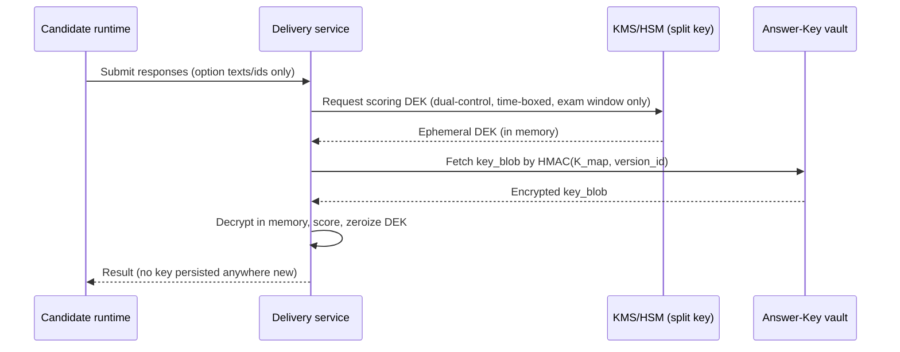

# 04 — Security Architecture

The spec sets an unusually strong threat model: **assume the attacker already has
database access, server access, network access, application access, or insider
privileges.** This document designs for that assumption. The headline result is that
**a full database dump does not reveal which answers are correct.**

---

## 1. Threat model

| Adversary | Capability assumed | What we must still protect |
|-----------|-------------------|----------------------------|
| External attacker | Network position, stolen creds | Confidentiality, integrity, availability |
| **DB-compromised attacker** | Full read (and maybe write) of the primary DB | **Answer keys**, exam pre-disclosure, score integrity |
| Compromised app server | Code execution as the app role | Long-lived secrets, cross-tenant data |
| **Malicious insider** | Legit admin/DBA access | Answer keys, undetectable audit tampering, exam leakage |
| Candidate | Authenticated, motivated to cheat | Exam content pre-disclosure, scoring manipulation, impersonation |

The design goal is **graceful degradation under compromise**: any single breached layer
should not hand over the crown jewels (answer keys + ability to alter results silently).

---

## 2. The crown jewel: split-key answer protection

This is the defining security property. Stated as an invariant:

> No single system component — not the question-bank DB, not the app server, not a DBA
> — holds, simultaneously and in the clear, *(a)* the exam content and *(b)* which
> response is correct.

### 2.1 Physical separation

- **Question content** (`item_versions.content`) lives in the main DB and contains the
  stem and option *texts* only — **no correctness markers**.
- **Answer keys** live in a separate `vault` — a different PostgreSQL schema with its own
  role (ideally a separate database/instance, network-isolated). The app's main DB role
  has **no grant** on `vault`.
- The vault row is keyed by an **opaque `version_token`** (random UUID), *not* by
  `item_version_id`. There is deliberately **no foreign key** from content to key.

### 2.2 The mapping is itself a secret

The translation `item_version_id → version_token` is not a plaintext column. It is
derived as a keyed hash:

```
version_token = HMAC(K_map, item_version_id)
```

`K_map` is held in the KMS/HSM, never in the DB. So even an attacker who reads both the
content table *and* the vault cannot align rows without `K_map`.

### 2.3 Split-key encryption of the key blob

The actual scoring truth (`answer_keys.key_blob_enc`) is encrypted with a data key that
is itself **split** (Shamir 2-of-3 or KMS+HSM dual control):

```
DEK = combine(share_KMS, share_HSM)         # neither alone suffices
key_blob = AES-256-GCM_encrypt(DEK, scoring_truth)
```

Decryption requires cooperation of two custodians (e.g. the KMS service and the HSM),
so a single compromised server cannot decrypt at rest.

### 2.4 Runtime assembly per sitting

At delivery the runtime never persists a question-with-answer record. Scoring resolves
the key **just-in-time, in memory, scoped to one sitting**, and discards it:



**Net effect:** dumping the question bank gives questions; dumping the vault gives
opaque encrypted blobs with no link to questions; compromising one custodian gives no
plaintext key. You need *content DB + vault + K_map + both key shares* to learn answers
— four independently protected things.

---

## 3. Data protection (encryption)

| Layer | Mechanism |
|-------|-----------|
| **At rest** | DB volume encryption (LUKS/cloud-managed) + **field-level** encryption of PII, MFA secrets, identity-verification biometrics, evidence media |
| **In transit** | TLS 1.3 everywhere, including app↔DB, app↔Redis, app↔inference, and edge↔HQ sync |
| **Field-level** | AES-256-GCM via a **per-institution key** (`institutions.encryption_key_ref` → KMS), so one tenant's leaked ciphertext is useless against another |
| **Key management** | KMS as the root of trust; HSM for the answer-key custodian share; **automatic key rotation** with versioned ciphertext (each record stores the key version used) |
| **Secrets** | No secrets in env files in prod — pulled from a secrets manager (Vault/cloud KMS) at boot; short-lived, rotated |

Biometric data (face/voice templates for identity verification) is treated as the most
sensitive PII: encrypted field-level, retention-limited, and never leaves the proctoring
context.

---

## 4. Zero-trust access model

- **No implicit trust by network location.** Every request — including service-to-service
  and edge↔HQ — is authenticated and authorized; being "inside the cluster" grants nothing.
- **Short-lived credentials.** Service identities use mTLS/workload identity with rotating
  certs; human sessions use short JWT access tokens + rotating refresh tokens bound to a
  device/session row.
- **Least privilege at the DB.** The app uses a role with no `vault` grants, no `SUPERUSER`,
  and `REVOKE UPDATE, DELETE` on append-only tables. Analytics uses a read-only replica role.
- **Just-in-time, time-boxed elevation.** The scoring DEK is only releasable during an
  exam's scoring window and only to the delivery/scoring workload identity — requested,
  logged, and expired.

---

## 5. RBAC & authorization model

Authorization is the union of permissions over a subject's **scoped role assignments**
(doc 03 §1). Resolution:

```
effective(subject, resource) =
    ⋃ { role.permissions
        | assignment ∈ subject.assignments
        ∧ assignment.scope is ancestor-or-self of resource.org_node
        ∧ assignment.institution = resource.institution }
```

- Enforced via Laravel **Policies** per aggregate (`ItemPolicy`, `AssessmentPolicy`, …),
  not scattered `if` checks.
- **Separation of duties is structural:** the workflow states (Author → Reviewer →
  Moderator → Approver) require *different* subjects; the same user cannot author and
  approve the same item version. Encoded as a policy invariant, not a UI hint.
- **Break-glass** admin actions (e.g. voiding a sitting, manual score override) require
  reason text and emit a high-severity audit entry + notification to QA.

---

## 6. Question & exam confidentiality lifecycle

| Phase | Control |
|-------|---------|
| Authoring | Item content encrypted field-level; answer key written straight to vault, never to a temp table |
| Pre-exam | Variants pre-assembled but answer keys **not** materialized; manifests in S3 are encrypted |
| Exam window | Server-authoritative timer; lockdown browser; runtime assembly only |
| Scoring | JIT key resolution, in-memory, zeroized after |
| Post-exam | Items can be retired; published variants retained immutably for disputes |
| Offline centers | Edge gets content + (optionally) a **time-boxed, exam-window-only** encrypted key blob, or defers scoring to HQ entirely |

---

## 7. Audit & tamper-evidence

The audit log (doc 03 §7) is the backstop against insiders.

- **Append-only at the DB level:** the app role has `INSERT` only on `audit_entries`;
  `UPDATE`/`DELETE` are revoked. Deletion requires a privileged migration, itself logged.
- **Hash-chained:** `entry_hash = SHA-256(prev_hash ‖ canonical_json(payload))`. Any
  retroactive edit invalidates the chain from that point forward.
- **Externally anchored:** the chain head is periodically published (signed) to an
  append-only external store / blockchain anchor, so even an attacker who rewrites the
  whole chain in-DB cannot match the externally witnessed head.
- **Comprehensive:** item create/edit/preview/print/export, exam access, login,
  submission, score publish, and every admin action are logged with actor, scope, and
  correlation id.

---

## 8. Anti-cheating & integrity (application layer)

- **Server-authoritative everything that matters:** time/deadlines, randomization seeds,
  scoring. The client is never trusted for anything that affects outcomes.
- **Per-session answer mapping** so two candidates' option indices are unrelated —
  shoulder-surfing "the answer is B" is meaningless.
- **Rate limiting & anomaly detection** on auth, submission, and API surfaces.
- **Lockdown browser + proctoring** (doc 05) as the candidate-device controls.
- **Collusion detection** via response-pattern similarity analysis in analytics.

---

## 9. Platform hardening (baseline)

- OWASP ASVS-aligned controls; input validation at the boundary; parameterized queries
  only (Eloquent/PDO) — no string SQL.
- CSP, HSTS, secure cookies, SameSite, anti-CSRF on session routes.
- Dependency scanning (Dependabot), SAST in CI (PHPStan + security rules), container
  image scanning, IaC scanning.
- WAF + rate limiting at the edge; bot/automation detection on candidate endpoints.
- Secrets never logged; PII redaction in logs; structured logs only.

---

## 10. What's implemented now vs. designed

This phase delivers the **schema-level** realization of the model: the `vault` schema
separation, append-only audit table with hash columns, per-tenant `encryption_key_ref`,
and the absence of correctness flags in item content. The cryptographic machinery
(KMS/HSM integration, Shamir splitting, JIT DEK release) is specified here and
implemented in the Scoring/Vault module in a later phase. Anything not yet wired is
called out as such — no security control is claimed as done until it runs and is tested.
