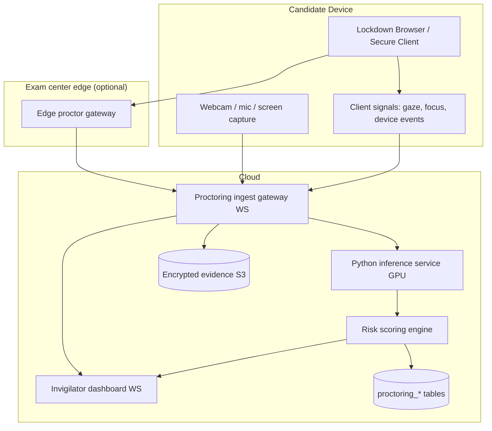

# 05 — Proctoring Architecture

The proctoring system must detect misconduct without being a privacy black box or a
cost sink. The design principle is a **tiered signal pipeline**: cheap, local signals
run on every candidate; expensive GPU inference runs only on escalation; and every
conclusion is **explainable and evidence-backed** so it survives an appeals process.

---

## 1. Design principles

1. **Explainability over verdicts.** The system never outputs "cheater." It outputs a
   risk score with a timeline of specific, evidenced flags a human can review.
2. **Human-in-the-loop authority.** AI flags and risk scores are *advisory*. Voiding a
   sitting is a human decision, audited and appealable.
3. **Tiered cost.** Most signals are computed client-side or on the edge for free;
   server GPU inference is invoked by sampling and by escalation, not on every frame.
4. **Privacy by design.** Biometric templates are encrypted, retention-limited, and
   scoped to the proctoring context; candidates consent and see what is monitored.
5. **Degrade safe.** If inference is unavailable, the system records raw evidence for
   later review rather than silently passing or failing candidates.

---

## 2. Component topology



The inference plane is the **Python/FastAPI service** introduced in the architecture doc
(GPU, separate image), reached through `App\Modules\Proctoring\Contracts\InferenceClient`
so the vision/audio model can be swapped without touching domain code.

---

## 3. Signal tiers

| Tier | Where it runs | Cost | Example signals |
|------|---------------|------|-----------------|
| **T1 Device/browser events** | Candidate client | ~free | tab/app switch, copy/paste/print attempts, focus loss, devtools open, multiple monitors, clipboard access, fullscreen exit |
| **T2 Lightweight on-device CV** | Candidate client (WASM/TFLite) | low | face present/absent, multiple-face presence, gaze direction (looking away), head pose |
| **T3 Server inference (sampled/escalated)** | Cloud GPU | high | face *identity match* vs. enrolment, voice match, phone/object detection, screen-content analysis, environment scan review |
| **T4 Cross-session analytics** | Batch workers | offline | collusion via response-pattern similarity, timing anomalies, answer-change patterns |

**Escalation logic:** T1/T2 run continuously and cheaply. When their combined signal
crosses a policy threshold (per `proctoring_policies.signals`), the gateway escalates
the relevant time window to T3 GPU inference and captures an evidence clip. This keeps
GPU cost proportional to *suspicion*, not to candidate-hours — essential at 1M scale.

---

## 4. Detection coverage (mapped to spec)

The spec enumerates many behaviors; each maps to a tier and a `proctoring_flags.type`:

| Spec behavior | Tier | Flag type |
|---------------|------|-----------|
| Looking away frequently | T2 | `gaze_away` |
| Multiple faces / face absence | T2→T3 | `multiple_faces`, `face_absent` |
| Phone usage / external screen | T3 | `phone_detected`, `external_screen` |
| Talking / whispering / background voices | T3 | `voice_detected`, `background_voice` |
| Headset usage | T2/T3 | `headset_detected` |
| Tab/app/screen switching | T1 | `tab_switch`, `app_switch` |
| Copy-paste attempts | T1 | `clipboard_attempt` |
| VM / remote desktop usage | T1 | `vm_detected`, `remote_desktop` |
| Browser devtools / extensions | T1 | `devtools_open`, `extension_detected` |
| Multiple monitors | T1 | `multi_monitor` |
| AI-assistance attempts | T1/T3/T4 | `ai_assist_suspected` |
| Unusual answer patterns / collusion | T4 | `answer_anomaly`, `collusion_suspected` |

Each flag carries `confidence`, `occurred_at`, `source`, and an optional `evidence_clip_id`.

---

## 5. Identity verification

Before and during a sitting:

- **Onboarding:** ID document capture + liveness check + face enrolment (template
  encrypted field-level, per-institution key).
- **Continuous:** periodic face match against enrolment (T3, sampled) to detect a
  candidate swap mid-exam → `identity_mismatch` flag.
- **Voice match** (optional, for oral/viva components).
- Results stored in `proctoring_sessions.identity_verification` as match scores, not raw
  biometrics in the open.

---

## 6. Lockdown browser / secure client

A dedicated secure-client mode (desktop app or hardened kiosk) enforces the
candidate-device controls the spec lists:

**Prevent:** copy, paste, print, screenshot, screen recording, tab switching,
application switching, remote desktop, developer tools.

**Detect (and flag, since prevention is never absolute):** virtual machines,
debuggers, automation tools (Selenium/AutoIt-style), macro tools, browser extensions,
secondary displays.

Design notes that keep this honest:

- **Prevention is best-effort; detection is the real defense.** We assume a determined
  candidate can defeat any single client control, so every prevented action that can be
  *attempted* also raises a flag, and server-side correlation (T4) catches what the
  client misses. We do not claim unbreakable lockdown.
- **Attestation:** the secure client attests its integrity to the server (signed build,
  environment checks) at session start; failed attestation blocks the high-stakes mode
  or forces live human proctoring.
- **Graceful fallback:** institutions can choose `ai_only`, `record_review`, `live`, or
  `none` per assessment via the proctoring policy — not every exam needs lockdown.

---

## 7. Risk scoring (explainable)

The `risk_assessments` aggregate turns flags into a defensible score:

```
cheating_probability = calibrated_aggregate(
    Σ over flags of  w(type) · confidence · recency · corroboration
)
```

- **Weights `w(type)`** are policy-configured: a `tab_switch` is weak; a sustained
  `face_absent` + `voice_detected` + `answer_anomaly` cluster is strong.
- **Corroboration** boosts independent signals that co-occur (multiple modalities agree)
  and discounts lone noisy signals.
- **Calibration:** the aggregate is calibrated against reviewed outcomes so a "0.8" means
  roughly an 80% historical confirm rate — not an arbitrary number.
- **Timeline:** `risk_assessments.timeline` lists the contributing flags with timestamps
  and evidence links, so the score is fully reconstructable. This is what an invigilator,
  a QA officer, and an appeals board actually look at.

A high score **routes the sitting to a human review queue** (an `AssessmentPublished`-style
event to the QA context); it never auto-voids a result.

---

## 8. Live invigilator experience

Over WebSockets (architecture doc §6), an invigilator sees:

- A **grid of candidate tiles** for assigned sittings, each with live webcam thumbnail,
  current risk level (color), and recent flags.
- **Real-time flag stream** with one-click jump to the evidence clip.
- **Interventions:** message a candidate, request a 360° room rescan, pause/lock a
  sitting, escalate to a senior proctor — each action audited.
- Scoped strictly: an invigilator's channel authorization only admits sittings assigned
  to them in their tenant (broadcasting auth).

---

## 9. Evidence handling

- Clips are captured around flagged windows (`from_ts`/`to_ts`), stored **encrypted** in
  S3, referenced by `evidence_clips`.
- Retention is policy-bound (e.g. 90 days post-result, longer if disputed) and then
  cryptographically shredded.
- Access to evidence is itself audited — viewing a candidate's clip is a logged action.

---

## 10. Privacy, fairness, and appeals

- **Consent & transparency:** candidates are shown what is monitored before starting.
- **Bias guardrails:** face/gaze models are a known fairness risk (lighting, skin tone,
  disability). Mitigations: configurable sensitivity, never auto-deciding, mandatory
  human review for any adverse action, and accessibility accommodations (a candidate
  flagged for "looking away" may have an approved accommodation that suppresses that
  signal).
- **Appeals:** because every score is explainable and evidence-linked, a candidate can
  contest specific flags; the review decision (`risk_assessments.status`:
  cleared/upheld) is recorded and audited.

---

## 11. Implemented now vs. designed

This phase delivers the **proctoring schema** (sessions, flags, evidence, risk
assessments) and this architecture. The client signal SDK, the Python inference service,
and the live dashboard are built in later phases against the `InferenceClient` contract.
As elsewhere, nothing is claimed functional until it runs and is tested — the value here
is a sound, privacy-respecting, explainable design the implementation conforms to.
