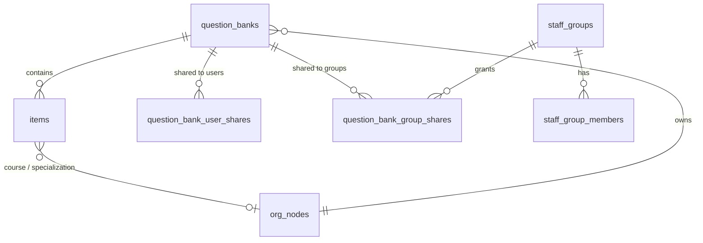

# 18 — Question Banks & Visibility

This corrects an early modelling gap: questions were stored directly under the institution
with no container and no privacy. A **Question Bank** is now a first-class container with a
**visibility policy**, and a **question belongs to exactly one bank** while carrying its own
**course, specialization, and tags** for cross-bank filtering when assembling assessments.

## Concepts

- **Question Bank** — a container, *owned by* an org node (department / programme / course).
  It holds the visibility policy. (`question_banks`)
- **Question** (item) — belongs to one bank (`items.question_bank_id`) and additionally
  carries `course_org_node_id`, `specialization_org_node_id`, and `tags[]`.
- **Specialization** — a first-class org-hierarchy node type (added to the org tree
  alongside faculty/department/programme/course/topic/learning-outcome).

## Visibility (on the bank, not the question)

`question_banks.visibility` is one of:

- **`org_subtree`** — readable by staff scoped to the bank's owning org node *and below*
  (covers "my department" and "the course/module it belongs to" — determined by which org
  node owns the bank).
- **`restricted`** — readable only by the owner plus explicit shares.

On top of either base, **shares are additive**:
- **User shares** (`question_bank_user_shares`, with `can_edit`)
- **Group shares** (`question_bank_group_shares`) to a **staff group** (`staff_groups` +
  `staff_group_members`) — a reusable named set of staff (e.g. "Physics examiners").

## Resolution (`BankVisibilityResolver`)

A subject **can read** a bank when any of these holds:
1. they have `questionbank.bank.manage_all` (institution admins / exam officers),
2. they created it,
3. it's shared to them directly, or to a staff group they belong to,
4. its visibility is `org_subtree` and one of the subject's role-assignment scopes is an
   **ancestor-or-self** of the bank's owning org node (an institution-wide, null-scope
   assignment covers everything).

`can edit` is owner / manage-all / a share marked `can_edit`. All five paths are unit-tested
(`BankVisibilityTest`).

## How it flows through the platform

- **Authoring a question** requires naming a writable bank — the API rejects authoring into
  a bank you can't edit (403, tested).
- **Assembling an assessment** restricts the candidate pool to the **banks the assembling
  author may read** (unless they manage all), and the blueprint may further filter by
  `bank_ids`, `course_org_node_id`, `specialization_org_node_id`, and `tags`. Verified:
  an author scoped to one department only draws from that department's bank, never a
  sibling's (`BankAssemblyTest`).

## API

| Method & path | Purpose |
|---------------|---------|
| `GET /api/question-bank/banks` | list banks the caller may read |
| `POST /api/question-bank/banks` | create a bank (`name`, `owner_org_node_id`, `visibility`) |
| `POST /api/question-bank/banks/{id}/share-user` | share to a user (`can_edit`) |
| `POST /api/question-bank/banks/{id}/share-group` | share to a staff group |
| `GET /api/question-bank/groups` · `POST /groups` | list / create staff groups |
| `POST /api/question-bank/items` | now requires `question_bank_id` (+ optional course / specialization / tags) |

## Permissions

`questionbank.bank.create`, `questionbank.bank.share`, `questionbank.bank.manage_all`.
`question_author` can create/share banks; `exam_officer` and `institution_admin` additionally
manage all banks in the tenant.

## Migration note

Existing items predate banks (`question_bank_id` is nullable for backward compatibility).
The service permits a null bank for internal/legacy use; the HTTP layer and UI require one,
so all new questions belong to a bank.
